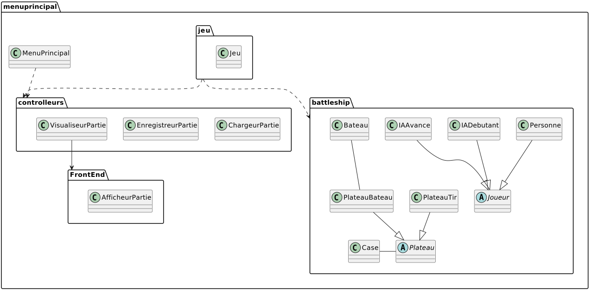
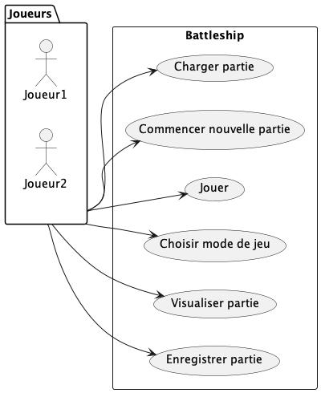

 

UNIVERSITÉ DU QUÉBEC À MONTRÉAL 
DÉPARTEMENT D'INFORMATIQUE

       

PROJET DE SESSION 
PARTIE 1

      

TRAVAIL PRÉSENTÉ À 
M. GNAGNELY SERGE DOGNY 
COURS INF5153 - GÉNIE LOGICIEL (CONCEPTION) 
GROUPE 040

  

PAR 
LYSANNE CHAGNON CHAL65550003 
FÉLIX PARADIS PARF04119608 
RENZO SALCEDO SALR02089408 
PHILIPPE BÉLANGER BELP07119706  

   

6 NOVEMBRE 2022

----

# TABLE DES MATIÈRES

### Diagramme de classes
### Diagramme de packages du système
### Diagramme de composants
### Diagramme de déploiement du système
### Diagramme de cas d'utilisation
### Diagrammes de séquence

- **Charger la partie** 
- **Choisir le mode de jeu**  
- **Nouvelle partie**  
- **Tirer**  
- **Visualiser la partie**  
- **Placer les navires**  
- **Enregistrer la partie**  
- **Choisir la case**  
- **Jouer**

# Diagramme de classes
 
------
Le système est composé des éléments suivants:

### Menu principal:
Il s'agit du menu au tout début du programme qui permet d'initialiser une partie, soit en créant une nouvelle, ou en chargeant une. 
Il s'agit donc d'un <u>créateur</u> de jeu.
Le menu principal a aussi un <u>faible couplage</u> avec le reste du système, car le jeu ne dépend pas de celui-ci pour fonctionner.

### Jeu:
Une classe qui assure une <u>forte cohésion</u> dans le système. orchestrant les actions des autres classes.
Cette classe sert essentiellement d'arbitre pour le jeu.

### Joueur:
La classe abstraite Joueur est <u>polymorphe</u>, elle peut jouer le rôle d'un joueur humain ou d'une intelligence artificielle.
Les méthodes *demanderTir()* et *demanderPlacerBateaux* auront des implémentations différentes tout dépendant du type de IA ou si le joueur est humain.

### Plateau:
Plateau représente une grille où ont peut soit placer un bateau ou visualiser les tirs effectués contre l'adversaire. Alors chaque joueurs
auront deux grilles assignés. Puisque les deux type de plateaux ont des responsabilités différentes, il s'agit d'une classe abstraite <u>polymorphe</u>.
Plateau est aussi un <u>spécialiste de l'information</u> car il contient et gère les cases du jeu, ainsi que les bateau s'il s'agit d'un PlateauBateau.
Lorsqu'un tir est effectué, on appelle ajouterTir() du PlateauTir du joueur, qui appelle à son tour ajouterTir() du PlateauBateau de l'adversaire. On assure une <u>forte cohésion</u> de cette
manière, car on est certain que les deux plateaux soient mise à jour en un appel.

### Bateau:
Représente les bateaux placés par le joueur. Classe à <u>faible couplage</u> simple qui retourne si une coordonnée le touche ou non.

### Case:
Classe à <u>faible couplage</u> simple. Représente l'état d'une case, soit s'il y a déja eu un tir ou non, et si oui, si le tir à touché un bateau ou non.

### VisualiseurPartie:
Le VisualiseurPartie a la responsabilité d'afficher le déroulement de la partie à la fin de celle-ci. C'est un <u>spécialiste de l'information</u>
puisqu'il contient la liste des plateaux en ordre chronologique de la partie, et il ne s'occupe pas de l'affichage directement, ça sera plutôt la
responsabilité de AfficheurPartie.

### AfficheurPartie:
Classe statique à <u>faible couplage</u>. À comme seule tâche d'afficher à la console un PlateauBateau et un PlateauTir.

### EnregistreurPartie:
Classe statique à <u>faible couplage</u>. Séréalise un jeu en format JSON et le sauvegarde dans un fichier.

### ChargeurPartie:
Classe statique à <u>faible couplage</u>. Charge un fichier JSON et initialise un jeu avec les propriétés défini dans le fichier. 

# Diagramme de packages du système
 

# Diagramme de composants
 

# Diagramme de déploiement du système
 

-----
# Diagramme de cas d'utilisation
  

# Diagrammes de séquence
## Charger la partie
 
Le joueur décide de jouer une partie existante, à partir d'un fichier JSON. On peut remarquer le
<u>faible couplage</u> puisque chaque objet a sa propre responsabilité. Dans ce cas, le menu agit aussi comme
un <u>contrôleur</u>, puisqu'il prend les commandes de l'acteur et délègue ensuite la responsabilité aux objets
concernés. Le ChargeurPartie appelle ensuite des librairies pour effectuer la gestion du fichier, ce qui réduit
d'avantage le couplage. Le Jeu est ensuite instancié à partir du fichier, et est retourné pour reprendre la partie.

## Choisir le mode de jeu
 
Avant de commencer une partie, le joueur doit décider s'il veut jouer contre un humain ou un ordinateur. lorsque le
joueur envoie sa réponse, l'objet Jeu instancie alors les objets nécessaires. Dans le diagramme, on remarque que le Jeu
instancie l'IAdebutant ou l'IAavance, ce qui resppecte le patron <u>créateur</u>. Puisque le Jeu contient des instances
de ces classes, c'est celui-ci qui les instancie.

## Nouvelle partie
 
Illustre le cas ou le joueur commence une nouvelle partie. C'est alors le menu principal qui instancie le jeu.

## Tirer
 
Lorsque c'est au tour du joueur d'effectuer un tir, le jeu lui demande les coordonnées. Ceci respecte le <u>principe de 
connaissance minimale</u> puisque le joueur ne fournit que des coordonnées. C'est ensuite le jeu
qui validera le tir avec les plateaux. On a alors un <u>faible couplage</u> étant donné que les plateaux ne sont connus
que par le jeu. Le jeu vérifie ensuite si tous les bateaux ont coulé avant de passer au prochain tour.
## Visualiser la partie
 
La visualisation de la partie se déroule à la fin du jeu, lorsqu'un gagnant a été déterminé par le jeu. Le jeu fait 
alors appel au visualiseur de partie, qui contient chacun des tours du jeu. On remarque encore le patron <u>Spécialiste
de l'information</u>, puisque c'est celui-ci qui contient les informations nécessaires à son fonctionnement. 
Le visualiseur délègue alors l'affichage de chaque tour de la partie à l'afficheur de partie, ce qui résulte 
en un <u>faible couplage</u>.
## Placer les navires
 
Au début du jeu, celui-ci demande au joueur de placer ses navires. Une boucle tourne jusqu'à ce que l'entièreté de 
ceux-ci aient été placés. On remarque encore une fois le patron <u>contrôleur</u>, représenté par le jeu,
qui gère toutes les communications avec le joueur et effectue les actions souhaitées sur les objets plateaux,
contenus dans la classe jeu. 

## Enregistrer la partie
 
À tout moment, lors de son tour, le joueur peut demander au jeu d'enregistrer la partie. Le jeu fait alors appel à un 
enregistreur de partie, qui fera appel aux mêmes librairies que le chargeur de partie pour enregistrer l'état du 
jeu sous forme de JSON. Encore une fois, ce mécanisme favorise un <u>faible couplage.</u> 
## Choisir la case
 
Ce diagramme illustre la manière dont les coordonnées envoyées par le joueur au jeu au moment de tirer sont traitées
par les plateaux. Les instanciations des objets dont le jeu a besoin se font par celui-ci. On remarque alors que le jeu
représente le patron <u>créateur</u>, ainsi que <u>contrôleur</u>. Le <u>principe de connaissance minimale</u> est aussi appliqué, 
puisque seuls les plateaux en ayant besoin communiquent entre-eux, soit les plateaux de tir qui connaissent les
plateaux de bateaux de l'ennemi.
## Creer matriceCase -- Extension de 'Choisir la case'
 
Ce diagramme représente l'instanciation des cases des différents plateaux. On peut remarquer le <u>faible couplage</u>
des différents objets.
## Jouer
 
Étant moins granulaire, ce diagramme représente une vue d'ensemble du déroulement du jeu. Chacun des mécanismes est décrit 
plus en détail par tous les diagrammes plus haut.

