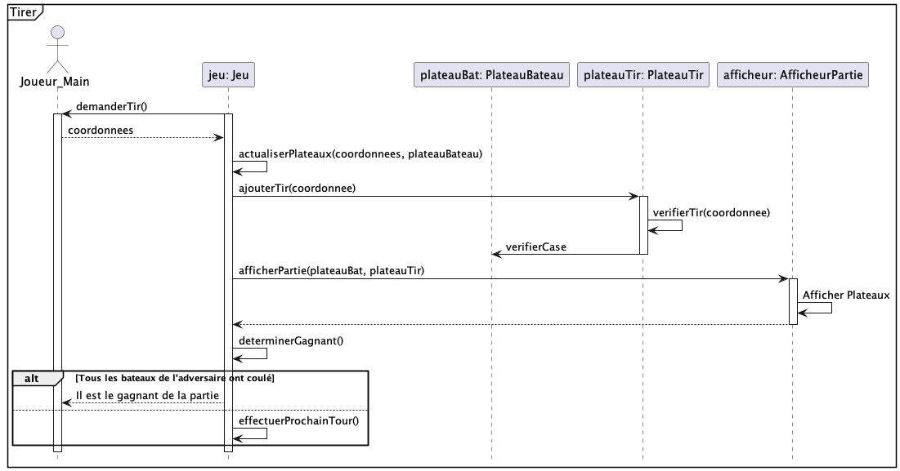

 

UNIVERSITÉ DU QUÉBEC À MONTRÉAL 
DÉPARTEMENT D'INFORMATIQUE

       

PROJET DE SESSION 
PARTIE 1

      

TRAVAIL PRÉSENTÉ À 
M. GNAGNELY SERGE DOGNY 
COURS INF5153 - GÉNIE LOGICIEL (CONCEPTION) 
GROUPE 040

  

PAR 
LYSANNE CHAGNON CHAL65550003 
FÉLIX PARADIS PARF04119608 
RENZO SALCEDO SALR02089408 
PHILIPPE BÉLANGER BELP07119706  

   

6 NOVEMBRE 2022

----

# TABLE DES MATIÈRES

### Diagramme de classes
### Diagramme de packages du système
### Diagramme de composants
### Diagramme de déploiement du système
### Diagramme de cas d'utilisation
### Diagrammes de séquence

- **Charger la partie** 
- **Choisir le mode de jeu**  
- **Nouvelle partie**  
- **Tirer**  
- **Visualiser la partie**  
- **Placer les navires**  
- **Enregistrer la partie**  
- **Choisir la case**  
- **Jouer**

# Diagramme de classes
 

------

# Diagramme de packages du système
 

# Diagramme de composants
 

# Diagramme de déploiement du système
 

-----
# Diagramme de cas d'utilisation
  

# Diagrammes de séquence
## Charger la partie
 

## Choisir le mode de jeu
 

## Nouvelle partie
 

## Tirer
 

## Visualiser la partie
 

## Placer les navires
 

## Enregistrer la partie
 

## Choisir la case
 

## Jouer
...

