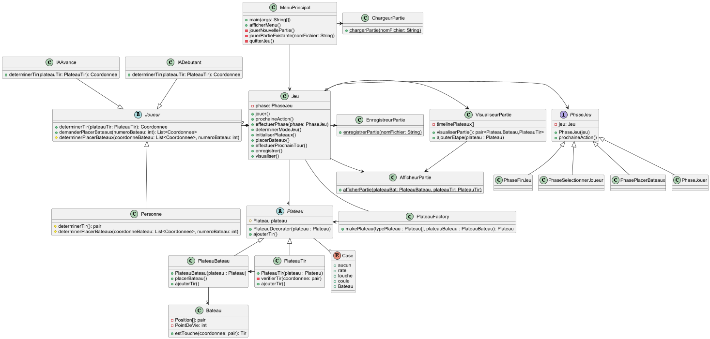
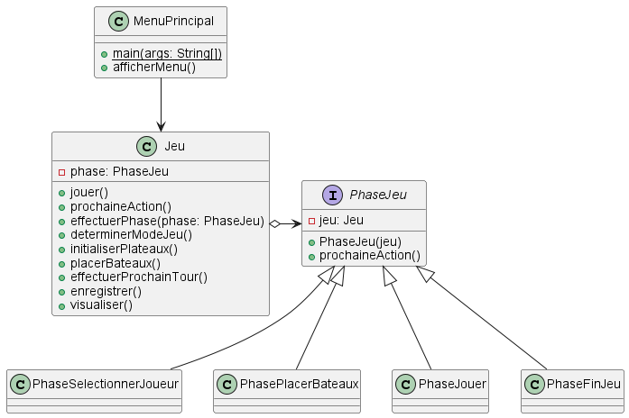
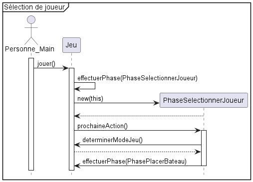
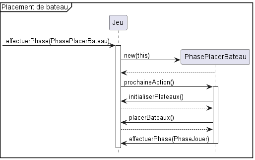
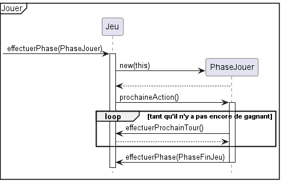
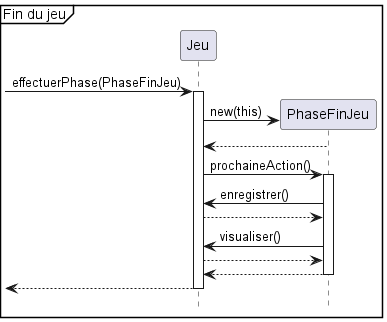

 

UNIVERSITÉ DU QUÉBEC À MONTRÉAL 
DÉPARTEMENT D'INFORMATIQUE

       

PROJET DE SESSION 
PARTIE 2

      

TRAVAIL PRÉSENTÉ À 
M. GNAGNELY SERGE DOGNY 
COURS INF5153 - GÉNIE LOGICIEL (CONCEPTION) 
GROUPE 040

  

PAR 
LYSANNE CHAGNON CHAL65550003 
FÉLIX PARADIS PARF04119608 
RENZO SALCEDO SALR02089408 
PHILIPPE BÉLANGER BELP07119706  

   

11 décembre 2022

----

# Diagramme de classes révisé
 

# Patrons de conception ajoutés
- Usine (Factory)
- État (State)
- Template method
- Façade

## État (State)

### Problématique
Il existe plusieurs phases dans l'exécution du jeu. En premier, on doit choisir quelle sorte de joueur sera notre adversaire,
ensuite on place nos bateaux, puis les deux joueurs s'échangent des tirs jusqu'à ce qu'un d'entre eux gagne, et finalement
on peut enregistrer la partie et la visualiser.

Dans notre implémentation précédente, les phases de jeu étaient écrites directement dans la classe Jeu, dans la méthode
*jouer()*. Cela peut potentiellement rendre la maintenance et l'ajout de nouveaux états difficile, surtout avec une méthode *jouer()* immense.

### Solution

 

En utilisant le patron de conception **état**, on peut définir clairement ce que Jeu doit faire lorsqu'il est dans un état
spécifique. Pour chaque enfant de *PhaseJeu*, on redéfinit la méthode *prochaineAction()* pour qu'elle appelle la méthode de *Jeu* qui doit être exécuté durant l'état, 
puis, lorsque l'exécution est complétée, on passe à l'état suivant avec *effectuerPhase()*.

On améliore la maintenabilité du code, car si on veut ajouter plusieurs états, il s'agit simplement de créer une classe enfant de *PhaseJeu* qui appelle les bonnes méthodes de *Jeu*.

### Diagrammes de séquences

Durant le déroulement du jeu, 4 états sont utilisés. Les voici en ordre d'exécution :

#### PhaseSelectionnerJoueur
 

#### PhaseplacerBateaux
 

#### PhaseJouer
 

#### PhaseFinJeu
 
