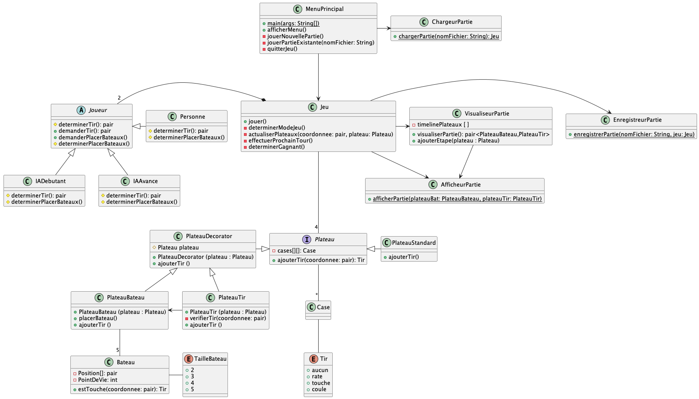
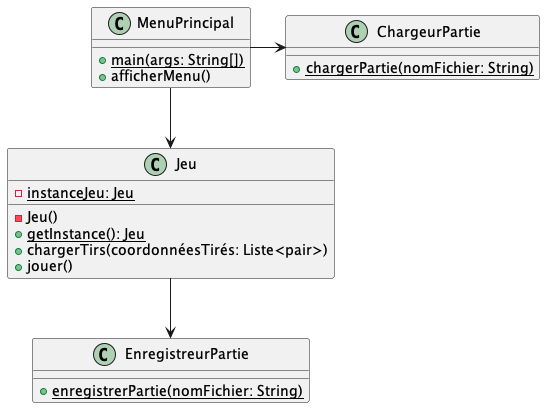
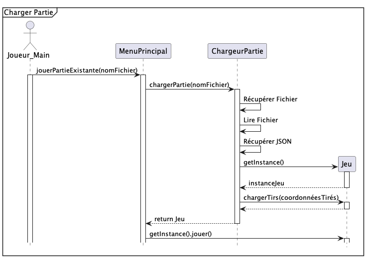
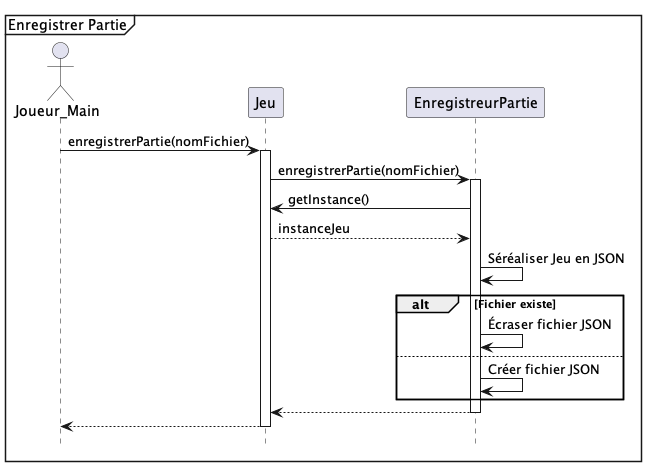
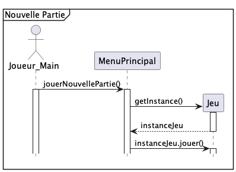
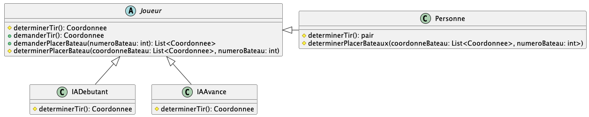
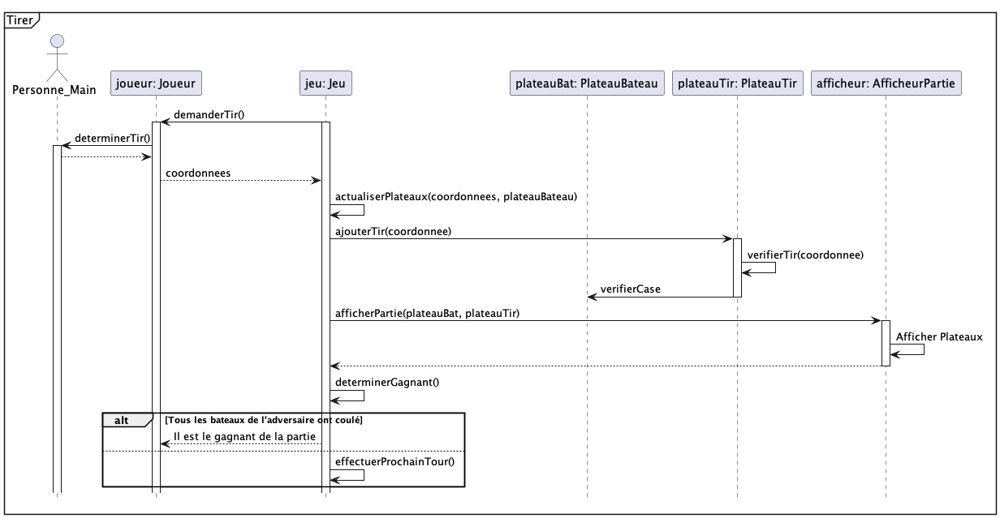
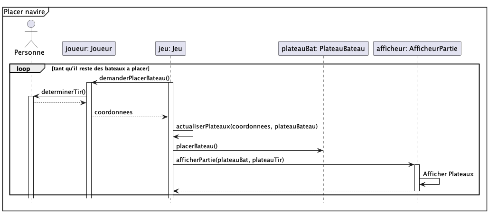

 

UNIVERSITÉ DU QUÉBEC À MONTRÉAL 
DÉPARTEMENT D'INFORMATIQUE

       

PROJET DE SESSION 
PARTIE 2

      

TRAVAIL PRÉSENTÉ À 
M. GNAGNELY SERGE DOGNY 
COURS INF5153 - GÉNIE LOGICIEL (CONCEPTION) 
GROUPE 040

  

PAR 
LYSANNE CHAGNON CHAL65550003 
FÉLIX PARADIS PARF04119608 
RENZO SALCEDO SALR02089408 
PHILIPPE BÉLANGER BELP07119706  

   

11 DÉCEMBRE 2022

----

# TABLE DES MATIÈRES

### Patrons de conception
- **Decorator**
- **Singleton**  
- **Template method**  
- **Facade**  

### Implémentation et différences de conception

# Patrons de conception
***
## Decorator

 

------
...description

-----

## Singleton

 

 

 

 

-----

...description

-----

## Template method

-----

 
 
 

-----

## Facade

-----

 

-----

L'objet Jeu représente ici le patron facade, en agissant comme interface pour
plusieurs sous-systèmes. Les joueurs communiquent avec le jeu, qui se charge de vérifier les règles
et d'appeler les bons objets.